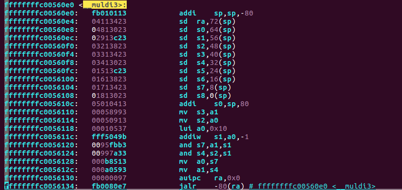
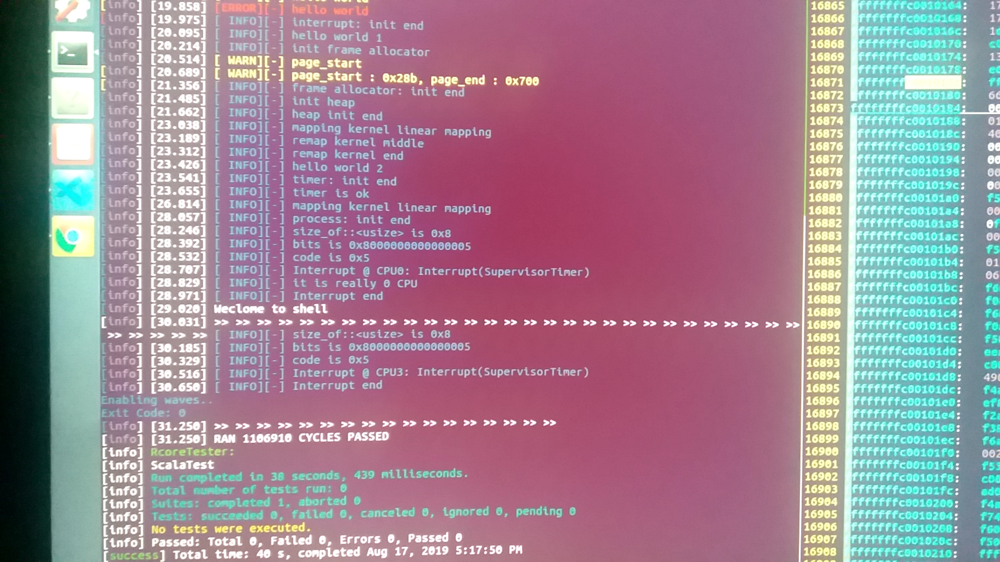

## rCore移植报告  

### rCore on RISC-V 64已有基础  

在暑期课程开始前，rCore on RISC-V 64已有的基础如下：

* 在qemu上可运行的多核版本
* 编译的目标架构为risc-v64 imac
* kernel运行于S态，openSBI作为bootloader且运行于M态，为kernel提供串口IO等服务。

### 为移植所做的修改内容  

原有思路为：

* 去除kernel/targets/riscv64.json中的“+m，+a，+c”特性，保证生成的二进制代码只包含I指令集的指令。

* 抛弃openSBI，在kernel的起始部分手动用汇编切换到S态，启用初始页表、将全部中断/异常处理委托给S态，M态不作处理。

* 修改读写串口部分。去掉openSBI之后，需要对kernel中读写串口的代码进行修改，放弃原有的调用ecall来读写串口的方式;改成了手动读写我们自己实现的串口控制器。

* 其他配置参数部分。包括rCore中硬编码的RAM大小、堆大小、物理页帧分配器的规模等。

实现过程中，对应的修改及遇到的问题如下：

* 在编译阶段，手动去掉“+m,+a,+c"特性。

  * 去掉"+a"将会导致编译器在某些需要原子操作的时候，调用如__atomic_load_8的函数。这些函数需要手动实现，相关代码在kernel/src/arch/riscv32/compiler_rt.rs中，使用rust进行了手动实现。需要注意的是，在rCore的多核情况下，我们并不能简单地通过软件开关中断来实现原子操作，但由于我们的CPU只考虑单核情况，所以可以手动通过开关中断来实现原子操作。添加对应函数之后，可以在去掉"+a"选项的情况下顺利通过编译。

  * "+c"选项可以直接去掉，不会导致编译错误。但是需要注意去掉了指令压缩之后，软件层面可能导致某些问题。（暂时没有遇到）

  * ”+m"选项是移植过程中遇到的较大的困难。"+m"代表RISC-V的M拓展，主要为乘除法指令。理论上来说，去掉这一编译选项之后，gcc/rust-nightly应当能够使用I指令集中的指令来模拟乘除法指令的执行。但是在实际调试过程中我发现，虽然编译时去掉"+m"选项并不会导致编译错误，生成的汇编代码中也有链接类似__muldi3这样的符号作为乘除法的模拟。但是编译器对RISC-V64的支持不够完善，生成的汇编代码中，模拟乘除法的指令是错误的。(比如下面图里面的指令)通过与rCore开发人员（王润基学长）分析情况，同时在他的电脑上复现了这一bug。确定其为gcc/rust-nightly工具链的bug。

    

    在确定这一编译器bug之后，发现的解决思路有两条：

    * 硬件层面让CPU支持M拓展。这样可以不去掉"+m"选项，也就避免了生成__muldi3这种错误的汇编代码。

    * CPU不支持M拓展，但是编译rcore时不去掉"+m"选项，在处理错误指令类型的中断处理例程中，手动用加减法模拟乘除法。

    考虑到第二种思路受中断是否开启的限制。在某些中断关闭的情况下将无法正确执行乘除法指令。我们选择了第一种思路进行拓展，不过由于时间原因，我们添加的M拓展只能通过功能仿真，在板子上由于时序问题仍然无法正确执行。
  
* 抛弃openSBI。需要手写的汇编代码在kernel/src/arch/riscv32/boot/entry64.asm中，将会被链接到kernel的起始位置。

* 修改串口读写部分。对应的修改代码在kernel/src/arch/riscv32/io.rs中。

* 其他配置部分主要为一些常数的修改。可以见kernel/src/arch/riscv32/Consts.rs。

### 最终结果  

由于时间原因，加上M拓展指令的调试对时序有强依赖（发现没有办法在仿真情况下复现这种bug）。我们最终没有能够完整支持M拓展指令，所以rcore在板子上仍然无法运行。但在仿真情况下可以正常boot，并完成一系列初始化。全部代码在github上。

上图为某次仿真结果。

